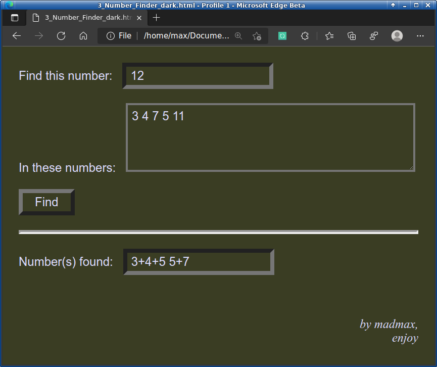

# 3_Number_Finder
Finds the subset of numbers whose sum is x

A typical scenario...

You have a price list of items purchased on a project.  Sometimes you find that 1, 2 or 3 items might be missing.  You must determine which groups of 2 or 3 numbers sum up to an amount; the observed difference in ledgers.

A tool I've used a few times to get out of a financial-data bind quick.

Example using integers for simplification:

